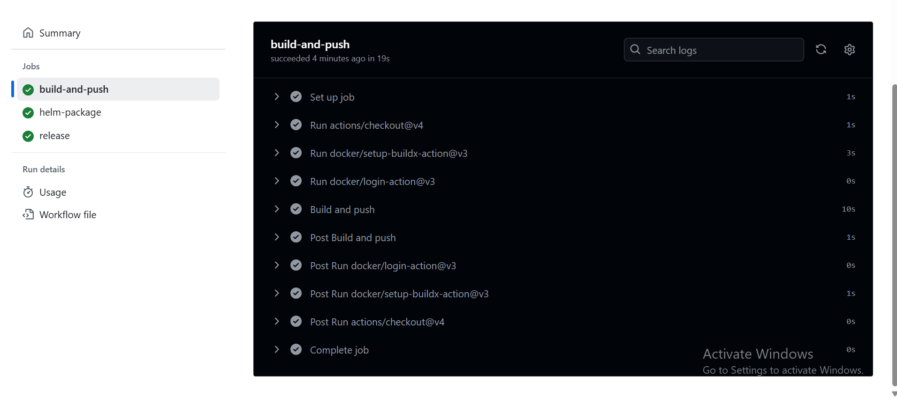

# Gandalf Web Server

A simple, modern web server built with **Python** and **Flask**. It features a homepage with Gandalf's picture and a button to view the current time in Colombo, Sri Lanka. The app exposes Prometheus metrics and is designed for secure, containerized deployment on Kubernetes with Minikube and MetalLB.

---

## Features

- **Homepage:** Shows Gandalf's picture and a button to view Colombo time.
- **Colombo Page:** Stylish page displaying the current time in Colombo, Sri Lanka.
- **Prometheus Metrics:** 
  - `/metrics` endpoint for observability.
  - `gandalf_requests_total`: Requests to the homepage.
  - `colombo_requests_total`: Requests to the Colombo page.
- **Kubernetes-ready:** Runs on a static IP with only port 80 open.
- **Containerized:** Docker image uses a non-root user and minimal base image.
- **Infrastructure as Code:** Terraform for provisioning.
- **Security:** Resource limits, readiness/liveness probes, no sensitive data in repo.

---

## Requirements

- Python 3.x
- Flask, prometheus_client, pytz
- Docker
- Minikube
- **Helm** (see installation below)
- Terraform
- Access to a cloud provider (for static IP and VM provisioning)

---

## Helm Installation

Helm is required for deploying kube-prometheus-stack and other charts.

**On Windows (with Chocolatey):**
```powershell
choco install kubernetes-helm
```

**On Windows (with Scoop):**
```powershell
scoop install helm
```

**On Linux/macOS:**
```sh
curl https://raw.githubusercontent.com/helm/helm/main/scripts/get-helm-3 | bash
```

Verify installation:
```sh
helm version
```

---

## Setup Instructions

### 1. Clone the Repository
```sh
git clone <repository-url>
cd k8s-web-deployment
```

### 2. Provision Infrastructure with Terraform
```sh
cd terraform
terraform init
terraform validate
terraform apply -auto-approve
```

### 3. Install Python Dependencies
```sh
pip install -r requirements.txt
```

### 4. Build the Docker Image
```sh
docker build -t gandalf-web:0.3 .
```

### 5. Install Minikube
SSH into your provisioned VM and run:
```sh
curl -LO https://storage.googleapis.com/minikube/releases/latest/minikube-linux-amd64
sudo install minikube-linux-amd64 /usr/local/bin/minikube
minikube start --driver=docker
```

### 6. Load Docker Image into Minikube
```sh
minikube image load gandalf-web:0.3
```

### 7. Deploy to Minikube
```sh
kubectl apply -f k8s/
```
This will apply your deployment, service, and ServiceMonitor manifests.

### 8. Access the Application

- **Port-forward (local testing):**
  ```sh
  kubectl port-forward svc/gandalf-web 8080:80
  ```
  Visit [http://localhost:8080](http://localhost:8080)

- **NodePort:**
  Get the NodePort assigned:
  ```sh
  kubectl get svc gandalf-web
  ```
  Access the app at `http://<minikube-ip>:<node-port>`

- **With MetalLB (if you change `type: NodePort` to `type: LoadBalancer`):**
  See the MetalLB section below.

---

## Monitoring with Prometheus & Grafana (kube-prometheus-stack)

### 1. Install kube-prometheus-stack with Helm

```powershell
helm repo add prometheus-community https://prometheus-community.github.io/helm-charts
helm repo update
helm install monitoring prometheus-community/kube-prometheus-stack `
    --namespace monitoring --create-namespace `
    --set grafana.service.type=NodePort
```
This chart bundles Prometheus, node-exporter, alertmanager, and Grafana.

Check pods:
```powershell
kubectl -n monitoring get pods
```
Wait until all pods show `Running` or `Completed`.

### 2. Expose Prometheus & Grafana

**a) Prometheus UI (port-forward):**
```powershell
kubectl -n monitoring port-forward svc/monitoring-kube-prometheus-prometheus 9090:9090
```
Open [http://localhost:9090](http://localhost:9090)

**b) Grafana (NodePort):**
```powershell
minikube service monitoring-grafana -n monitoring --url
```
Open the printed URL (e.g., `http://127.0.0.1:31000`)
Login: `admin` / `prom-operator`
Grafana ships with Prometheus as a pre-wired data source.

### 3. Tell Prometheus about gandalf-web

Your ServiceMonitor manifest is in `k8s/gandalf-servicemonitor.yaml` and should look like this:

```yaml
apiVersion: monitoring.coreos.com/v1
kind: ServiceMonitor
metadata:
  name: gandalf-monitor
  namespace: monitoring
  labels:
    app: gandalf-web
spec:
  namespaceSelector:
    matchNames:
      - default
  selector:
    matchLabels:
      app: gandalf-web
  endpoints:
    - port: http
      path: /metrics
      interval: 15s
```
- This allows Prometheus (in `monitoring` namespace) to scrape your service in the `default` namespace.
- Your service must have label `app: gandalf-web` and port name `http`.

Apply it (if not already applied):
```powershell
kubectl apply -f k8s/gandalf-servicemonitor.yaml
```
After ~30 seconds, in Prometheus UI (Status ▸ Targets), you should see `gandalf-web` with state UP.

### 4. Watch the Counters Climb

In Prometheus UI, run these queries:
- `gandalf_requests_total`
- `colombo_requests_total`

Generate some traffic:
```powershell
for ($i=1; $i -le 5; $i++) { curl -s http://localhost:8080/gandalf | Out-Null }
for ($i=1; $i -le 3; $i++) { curl -s http://localhost:8080/colombo | Out-Null }
```
Re-run the queries – the numbers should be 5 and 3 respectively.

### 5. Grafana Dashboard (Optional)

In Grafana:
- Go to **Dashboards ▸ + Import ▸ ID 1860** (Prometheus-stats template) for a quick graph.

---

## Metrics

- Prometheus scrapes metrics from the `/metrics` endpoint.
- Metrics exported:
  - `gandalf_requests_total`: Total homepage requests.
  - `colombo_requests_total`: Total Colombo page requests.
- See `k8s/gandalf-servicemonitor.yaml` for the ServiceMonitor configuration.

---

# MetalLB Configuration for Minikube

This project uses [MetalLB](https://metallb.universe.tf/) to provide LoadBalancer services for Kubernetes running on Minikube.

## Prerequisites

- [Minikube](https://minikube.sigs.k8s.io/docs/) running locally
- `kubectl` installed and configured to use your Minikube cluster

## Installation Steps

### 1. Install MetalLB

Apply the official MetalLB manifests to install the controller and speaker:

```powershell
kubectl apply -f https://raw.githubusercontent.com/metallb/metallb/main/config/manifests/metallb-native.yaml
```

Wait until all pods in the `metallb-system` namespace are running:

```powershell
kubectl get pods -n metallb-system
```

### 2. Configure MetalLB Address Pool

Apply the provided configuration file to set up the IP address pool and L2 advertisement:

```powershell
kubectl apply -f metallb-config.yaml
```

**Example `metallb-config.yaml`:**
```yaml
apiVersion: metallb.io/v1beta1
kind: IPAddressPool
metadata:
  name: minikube-pool
  namespace: metallb-system
spec:
  addresses:
  - 192.168.49.240-192.168.49.250 # adjustable
---
apiVersion: metallb.io/v1beta1
kind: L2Advertisement
metadata:
  name: l2adv
  namespace: metallb-system
```
- Make sure the IP range matches your Minikube network.
  You can check your Minikube IP with:
  ```powershell
  minikube ip
  ```

### 3. Expose Services Using LoadBalancer

You can now expose services using the `LoadBalancer` type. For example:

```powershell
kubectl expose deployment gandalf-web --type=LoadBalancer --port=80 --target-port=80 --name=gandalf-web-lb --load-balancer-ip=192.168.49.241
```

Check the service:

```powershell
kubectl get svc gandalf-web-lb
```

You should see the `EXTERNAL-IP` assigned from your configured pool.

### 4. (Windows/Mac) Start Minikube Tunnel

To access the LoadBalancer IP from your host, run:

```powershell
minikube tunnel
```

This may require administrator privileges.

---

## Process & Common Commands

This project is designed to run on Minikube. Below are the typical workflows, showing the evolution from manual `kubectl apply`, to Helm, and now to GitHub Actions CI/CD.

---

### 🟢 **A. Manual Minikube & kubectl apply Workflow (Initial Approach)**

1. **Start Minikube**
   ```powershell
   minikube start --driver=docker
   ```

2. **Build and Load Docker Image**
   ```powershell
   docker build -t gandalf-web:0.3 .
   minikube image load gandalf-web:0.3
   ```

3. **Deploy Manifests**
   ```powershell
   kubectl apply -f k8s/
   ```
   This applies your deployment, service, and ServiceMonitor manifests.

4. **Access the Application**
   - Port-forward:
     ```powershell
     kubectl port-forward svc/gandalf-web 8080:80
     ```
     Visit [http://localhost:8080](http://localhost:8080)
   - Or, NodePort:
     ```powershell
     kubectl get svc gandalf-web
     ```
     Access at `http://<minikube-ip>:<node-port>`

5. **Monitoring**
   - Prometheus:
     ```powershell
     kubectl -n monitoring port-forward svc/monitoring-kube-prometheus-prometheus 9090:9090
     ```
     Open [http://localhost:9090](http://localhost:9090)
   - Grafana:
     ```powershell
     minikube service monitoring-grafana -n monitoring --url
     ```
     Login: `admin` / `prom-operator`


4) Create a simple alert
A) In Grafana
Edit the “API request rates” panel

Go to the Alert tab

Click Create Alert

Expression: sum(rate(colombo_requests_total[1m])) > 1

Condition: “WHEN avg() OF query (A, 1m, now) IS ABOVE 1”

Set “Evaluate every” to 1m, “For” to 2m

Save the dashboard

---

### 🟡 **B. Helm-based Workflow (Recommended for Ongoing Use)**

1. **Start Minikube**
   ```powershell
   minikube start --driver=docker
   ```

2. **Build and Load Docker Image (for local dev)**
   ```powershell
   docker build -t gandalf-web:0.3 .
   minikube image load gandalf-web:0.3
   ```
   > If using images from Docker Hub (via CI), skip `minikube image load` and set the image tag in Helm.

3. **Deploy with Helm**
   ```powershell
   helm install gandalf ./gandalf-chart --namespace default --create-namespace
   ```
   - If you see an error about an existing ServiceMonitor:
     ```powershell
     kubectl delete servicemonitor gandalf-monitor -n monitoring
     helm install gandalf ./gandalf-chart --namespace default --create-namespace
     ```

4. **Access the Application**
   - After Helm install, check your service name:
     ```powershell
     kubectl get svc -n default
     ```
     Then use that name with minikube service ...
   - Or, port-forward:
     ```powershell
     kubectl port-forward svc/gandalf 8080:80 -n default
     ```
     Open [http://localhost:8080](http://localhost:8080)

5. **Upgrade or Rollback**
   - Upgrade image:
     ```powershell
     helm upgrade gandalf ./gandalf-chart --set image.tag=0.4
     ```
   - Rollback:
     ```powershell
     helm rollback gandalf 1
     ```

6. **Monitoring**
   - Prometheus:
     ```powershell
     kubectl -n monitoring port-forward svc/monitoring-kube-prometheus-prometheus 9090:9090
     ```
     Open [http://localhost:9090](http://localhost:9090)
   - Grafana:
     ```powershell
     minikube service monitoring-grafana -n monitoring --url
     ```
     Login: `admin` / `prom-operator`

---

### 🟣 **C. CI/CD with GitHub Actions (Automated Build & Release)**

1. **Push a Git Tag to Trigger CI/CD**
   ```sh
   git tag v0.5
   git push origin v0.5
   ```
   - This triggers the GitHub Actions workflow to:
     - Build and push your Docker image to Docker Hub.
     - Package and upload your Helm chart.
     - (Optionally) Create a GitHub release with the chart attached.

2. **Deploy from Docker Hub Image**
   - On your cluster:
     ```powershell
     helm upgrade --install gandalf ./gandalf-chart --set image.tag=v0.5
     ```

---

### ⚠️ **Common Errors & Rectifications**

- **SVC_NOT_FOUND:**  
  Run `kubectl get svc -n default` and use the correct service name with `minikube service ...`.

- **ServiceMonitor already exists:**  
  Delete it:  
  `kubectl delete servicemonitor gandalf-monitor -n monitoring`  
  Then re-run Helm install.

- **Pod stuck in ContainerCreating:**  
  Restart Minikube:  
  `minikube stop; minikube start`  
  Check node status:  
  `kubectl get nodes`

- **Prometheus not scraping:**  
  - Ensure your service has label `app: gandalf-web` and port name `http`.
  - Ensure ServiceMonitor is in `monitoring` namespace and has `namespaceSelector.matchNames: ["default"]`.
  - Delete and re-apply the ServiceMonitor if needed.
  - Check Prometheus UI → Status → Targets for errors.

---


## References

- [MetalLB official documentation](https://metallb.universe.tf/installation/)
- [Minikube LoadBalancer guide](https://minikube.sigs.k8s.io/docs/tutorials/loadbalancer/)

---

## License

This project is licensed under the MIT License.


Below is the merged, up-to-date README incorporating everything we covered today. You can copy & paste this into your repo.

````markdown
# Gandalf Web Server

A simple, modern web server built with **Python** and **Flask**. It features:
- Gandalf’s picture at `/gandalf`
- The current time in Colombo, Sri Lanka at `/colombo`
- Prometheus metrics at `/metrics`

It’s designed for secure, containerized deployment on Kubernetes (Minikube + MetalLB) and also runs as standalone Docker services (Gandalf, Prometheus, Grafana, Watchtower) on an EC2 VM via Terraform + cloud-init.

---

## Features

- **Homepage:** Gandalf’s picture  
- **Colombo Page:** Stylish display of current Colombo time  
- **Prometheus Metrics:**  
  - `/metrics` endpoint  
  - Counters: `gandalf_requests_total`, `colombo_requests_total`  
- **Kubernetes-ready:** Static IP + only port 80 open  
- **Containerized:** Non-root Docker image  
- **Infrastructure as Code:** Terraform modules for VPC & EC2  
- **Security:** Resource limits, probes, no secrets in repo  
- **CI/CD:** GitHub Actions for Docker Hub & Helm chart releases  

---

## Requirements

- Python 3.x + Flask, prometheus_client, pytz  
- Docker  
- Minikube  
- Helm  
- Terraform  
- AWS account (static EIP & EC2)  

---

## Local Kubernetes (Minikube + MetalLB)

### 1. Helm Prerequisite

```bash
curl https://raw.githubusercontent.com/helm/helm/main/scripts/get-helm-3 | bash
helm version
````

### 2. Clone & Build

```bash
git clone <repo-url>
cd k8s-web-deployment
docker build -t gandalf-web:0.3 .
```

### 3. Minikube Setup

```bash
minikube start --driver=docker
minikube image load gandalf-web:0.3
```

### 4. Apply Manifests

```bash
kubectl apply -f k8s/
```

This covers Deployment, Service, ServiceMonitor, etc.

### 5. Access

* **Port-forward:**
  `kubectl port-forward svc/gandalf-web 8080:80` → [http://localhost:8080](http://localhost:8080)
* **NodePort:**
  `minikube service gandalf-web --url`
* **LoadBalancer (MetalLB):**
  `minikube tunnel` + `kubectl get svc gandalf-web`

---

## MetalLB Configuration

```bash
kubectl apply -f https://raw.githubusercontent.com/metallb/metallb/main/config/manifests/metallb-native.yaml
kubectl apply -f metallb-config.yaml
```

```yaml
# metallb-config.yaml
apiVersion: metallb.io/v1beta1
kind: IPAddressPool
metadata:
  name: minikube-pool
  namespace: metallb-system
spec:
  addresses:
  - 192.168.49.240-192.168.49.250
---
apiVersion: metallb.io/v1beta1
kind: L2Advertisement
metadata:
  name: l2adv
  namespace: metallb-system
```

---

## Monitoring (Prometheus & Grafana)

### Install via Helm

```bash
helm repo add prometheus-community https://prometheus-community.github.io/helm-charts
helm repo update
helm install monitoring prometheus-community/kube-prometheus-stack \
  --namespace monitoring --create-namespace \
  --set grafana.service.type=NodePort \
  --set prometheus.prometheusSpec.maximumStartupDurationSeconds=120
```

### Access

* **Prometheus:**
  `kubectl -n monitoring port-forward svc/monitoring-kube-prometheus-prometheus 9090:9090` → [http://localhost:9090](http://localhost:9090)
* **Grafana:**
  `minikube service monitoring-grafana -n monitoring --url` → login `admin/prom-operator`

### ServiceMonitor

```yaml
apiVersion: monitoring.coreos.com/v1
kind: ServiceMonitor
metadata:
  name: gandalf-monitor
  namespace: monitoring
spec:
  namespaceSelector:
    matchNames: ["default"]
  selector:
    matchLabels: {app: gandalf-web}
  endpoints:
    - port: http
      path: /metrics
      interval: 15s
```

```bash
kubectl apply -f k8s/gandalf-servicemonitor.yaml
```

---

## Generating & Visualizing Metrics

1. **Query in Prometheus UI**
   `gandalf_requests_total`
   `colombo_requests_total`

2. **Drive Traffic:**

   ```bash
   for i in {1..5}; do curl -s http://localhost:8080/gandalf; done
   for i in {1..3}; do curl -s http://localhost:8080/colombo; done
   ```

3. **Grafana Dashboard**
   Import **ID 1860** for API request rates.

4. **Alerting**

   * In Grafana panel → **Alert**
   * Expr: `sum(rate(colombo_requests_total[1m])) > 1`
   * Notify if sustained for 2m.

---

## VM-based Docker Deployment (Terraform + cloud-init)

### Terraform Modules

* **`modules/vpc/`**: VPC, subnets, IGW, NAT, SG
* **`modules/ec2/`**: EC2 instance with EIP, user-data script

### `root/main.tf`

```hcl
module "vpc" { … }
module "ec2" {
  source            = "./modules/ec2"
  subnet_id         = module.vpc.public_subnet_1_id
  vpc_id            = module.vpc.vpc_id
  security_group_id = module.vpc.security_group_id
  key_name          = var.key_name
  public_subnet_id  = module.vpc.public_subnet_1_id
  dockerhub_user    = var.dockerhub_user
  image_tag         = var.image_tag
  app_private_ip    = var.app_private_ip
  grafana_private_ip = var.grafana_private_ip
}
```

### Cloud-Init / User-Data

The EC2 boots and runs:

1. **Docker**
2. **Gandalf Web**
3. **Prometheus**
4. **Grafana**
5. **Watchtower**

*(See `/modules/ec2/minikube.sh` in repo for full script).*

### Outputs

Terraform will emit:

* `instance_public_ip`
* `gandalf_web_url = "http://${aws_eip.app.public_ip}/gandalf"`
* `prometheus_url  = "http://${aws_eip.app.public_ip}:9090"`
* `grafana_url     = "http://${aws_eip.app.public_ip}:3000"`

---

## CI/CD (GitHub Actions)

Triggers on tag push (`v*`):

```yaml
jobs:
  build-and-push:
    uses: docker/build-push-action@v5
    with:
      push: true
      tags: |
        docker.io/${{ secrets.DOCKERHUB_USERNAME }}/gandalf-web:${{ github.ref_name }}
        docker.io/${{ secrets.DOCKERHUB_USERNAME }}/gandalf-web:latest
  helm-package:
    run: |
      helm dependency update gandalf-chart
      helm package gandalf-chart --app-version ${{ github.ref_name }} --version ${{ github.ref_name }}
```

Use on-cluster:

```bash
helm upgrade --install gandalf ./gandalf-chart --set image.tag=v0.5
```

---

## Common Errors & Fixes

* **Minikube driver issues:** prefer `--driver=docker` over `none` unless expert setup
* **CNI plugins missing:** install `containernetworking-plugins` for `none` driver
* **ServiceMonitor not picked up:** ensure labels/namespaces match
* **Pod CrashLoop:** check logs & resource limits

---


---

## References

* [MetalLB docs](https://metallb.universe.tf/)
* [Minikube load balancer tutorial](https://minikube.sigs.k8s.io/docs/tutorials/loadbalancer/)
* [Grafana alerting](https://grafana.com/docs/grafana/latest/alerting/)

---

## License

MIT

```

Let me know if you’d like any further tweaks or if I missed anything!
```
